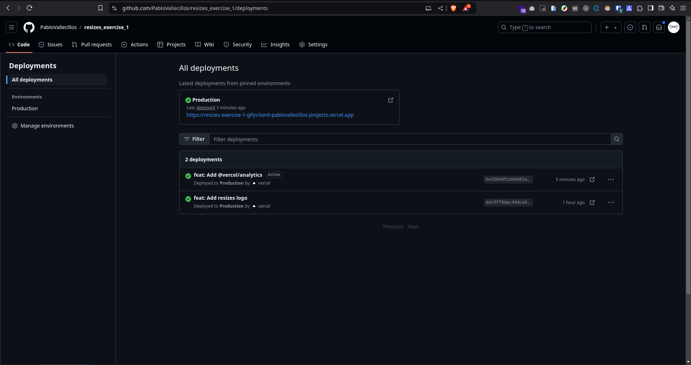
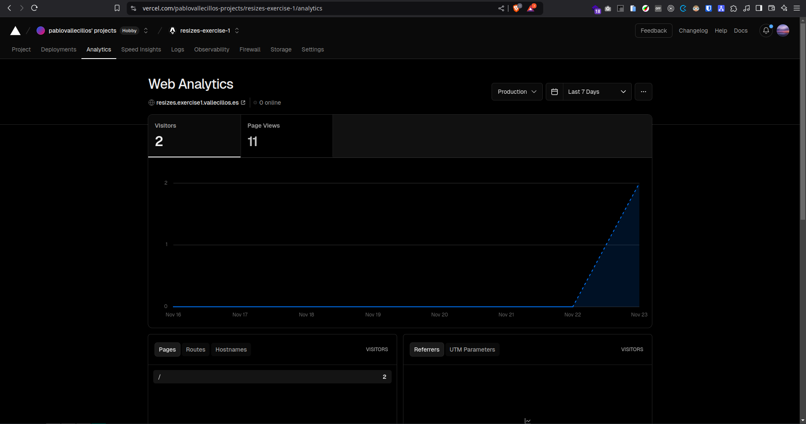
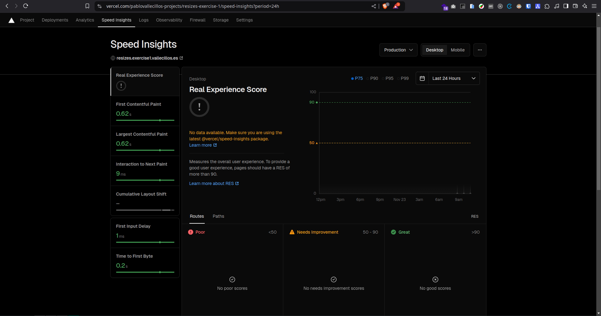
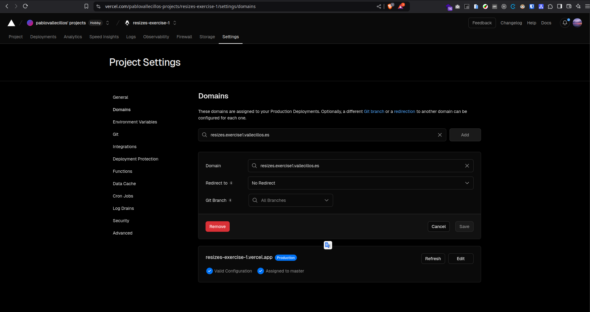
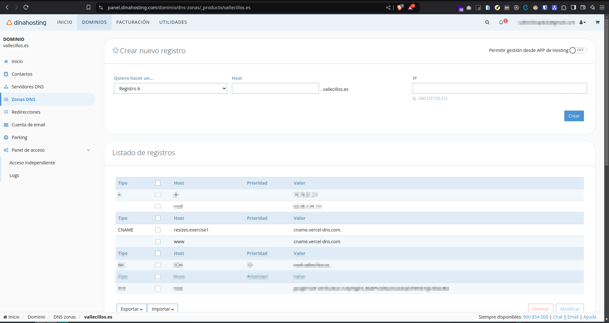

# Exercise 1: Static Web Hosting | SOLUTION
- [Frontend](https://resizes.exercise1.vallecillos.es/)
- [Github repository](https://github.com/PabloVallecillos/resizes_exercise_1)

> Which services from the provider will you utilize, and how will you configure them?

- **Hosting**
- **Automatics deployments** with [Vercel Github App](https://github.com/apps/vercel).

- **Analytics** with @vercel/analytics package.

- **Speed Insights** with @vercel/speed-insights package.

- **Custom Domain** adding CNAME record on my provider dynahosting.

  - **Subdomain** of my personal domain.
    

> What specific tools and technologies will you employ?

- Git with Github like version control system.
- Astro like frontend framework.
- Vercel like cloud infrastructure.
- Dinahosting like domain provider.

