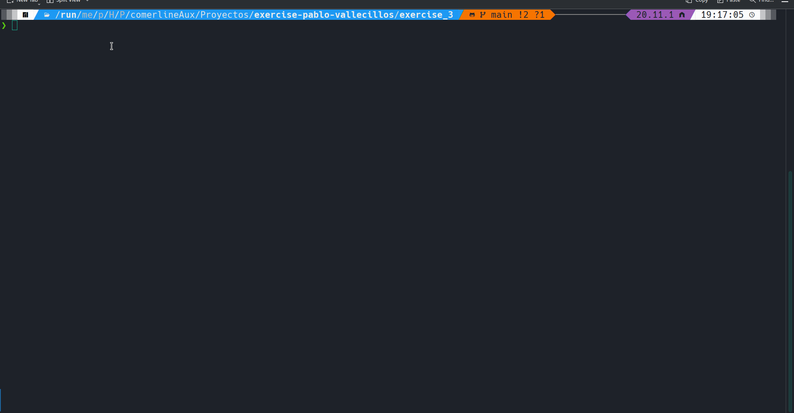
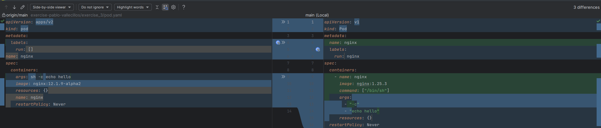
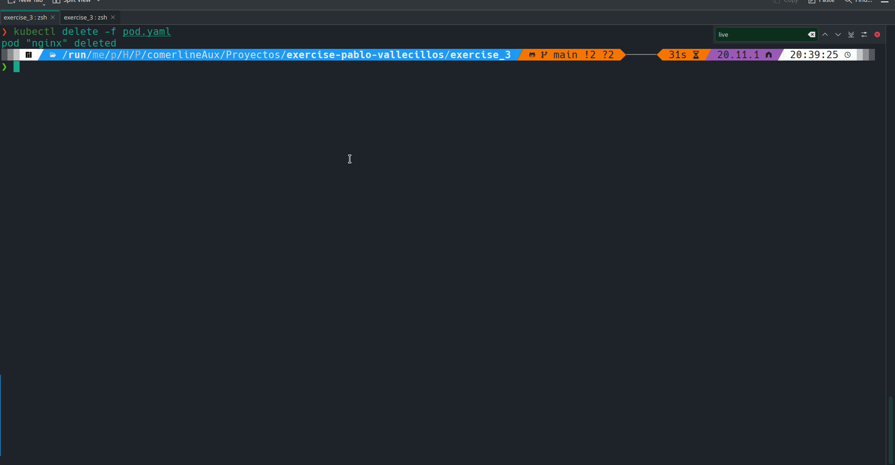
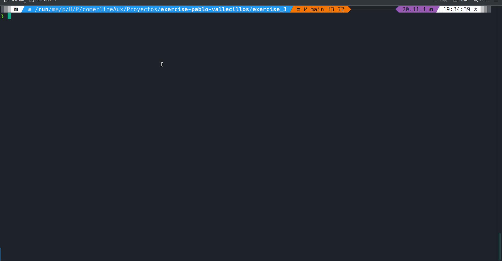
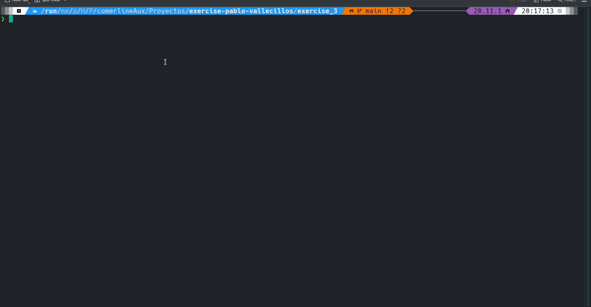

# Exercise 3: Kubernetes | SOLUTION

> Can you make the necessary updates so it can run successfully?



- Syntax corrections.



> How would you make sure the container is running as expected during start and after then?

- Add restartPolicy: Always to ensure pods restart automatically.
- Added livenessProbe and readinessProbe to monitor container health.
```yaml
apiVersion: v1
kind: Pod
metadata:
  name: nginx
  labels:
    run: nginx
spec:
  containers:
    - name: nginx
      image: nginx:1.25.3
      command: ["/bin/sh"]
      args:
        - "-c"
        - "echo hello"
      resources: {}
      livenessProbe:
        httpGet:
          path: /
          port: 80
        initialDelaySeconds: 5
        periodSeconds: 10
      readinessProbe:
        httpGet:
          path: /
          port: 80
        initialDelaySeconds: 5
        periodSeconds: 10
  restartPolicy: Always
```


> Create a `deployment.yaml` manifest with at least 3 replicas to make more reliable the app running.

- `deployment.yaml` was in main branch.



> Create a `service.yaml` to expose the deployment you just created on all cluster nodes to make it available for any other application running in the cluster.

- `service.yaml` was in main branch.



