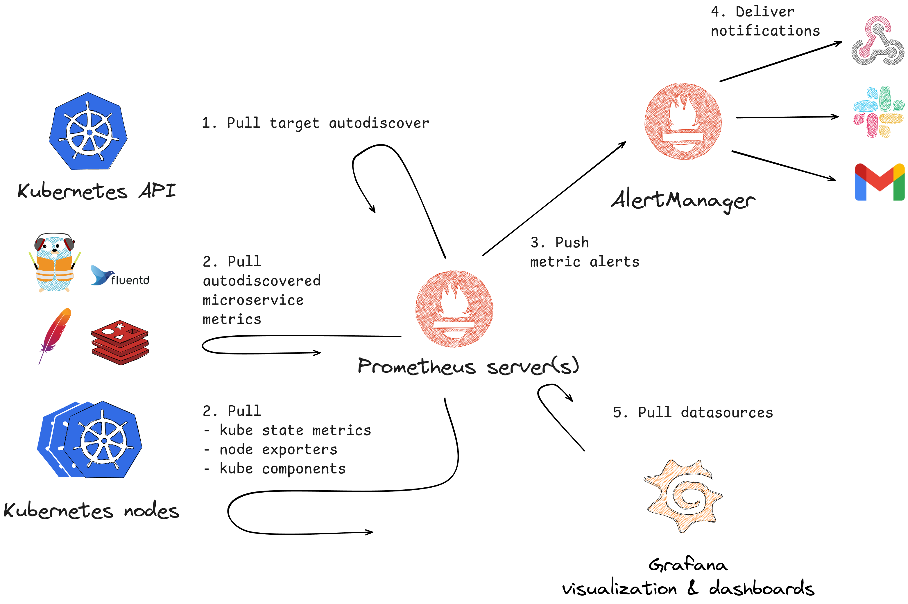

# Exercise 5: Observability | SOLUTION

### 1. Prometheus
- **Role**: Core metrics collection and storage.
- **Integration**:
    - Pulls metrics from Kubernetes components, including:
        - **Node Exporters**: For node-level metrics.
        - **Kube-State-Metrics**: For Kubernetes object states.
        - **Application Metrics**: From services or custom exporters (e.g., Fluentd or other tools for logging and monitoring).
    - Supports autodiscovery of targets via the Kubernetes API.

### 2. AlertManager
- **Role**: Centralized alert management.
- **Integration**:
    - Receives alerts from Prometheus.
    - Sends notifications to various channels:
        - **Webhooks**
        - **Slack**
        - **Email**

### 3. Grafana
- **Role**: Visualization and dashboarding.
- **Integration**:
    - Pulls data from Prometheus for creating user-friendly dashboards.
    - Supports multi-datasource configurations for extended visualization capabilities.

**OpenTelemetry** can add tracing, logging, and additional observability capabilities:

- Provides **end-to-end observability** by collecting traces, metrics, and logs in a standardized way.

### Integration
1. **Tracing**:
    - OpenTelemetry SDK/agent to generate and export traces.
    - Combine OpenTelemetry traces with a backend like: Jaeger
2. **Metrics**:
    - OpenTelemetry Metrics API alongside Prometheus to standardize custom application metrics.
3. **Logs**:
    - Forward logs to systems like Elasticsearch

System reference inspired by a presentation by @iblancasa called: Observability, the three dog problem and more.
